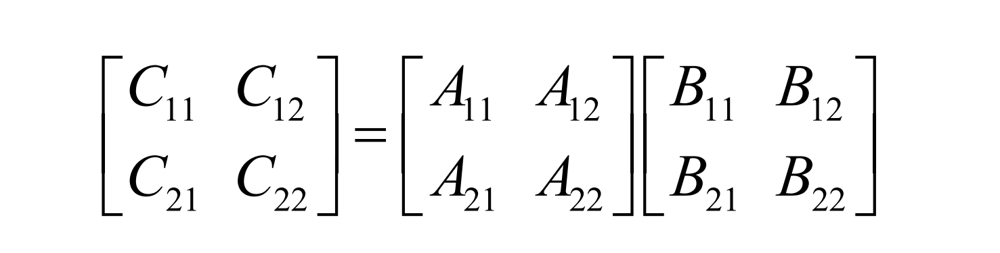
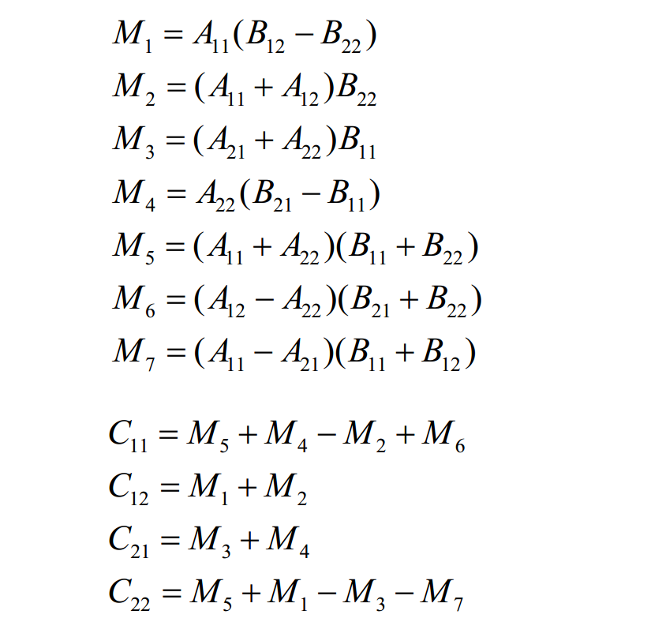
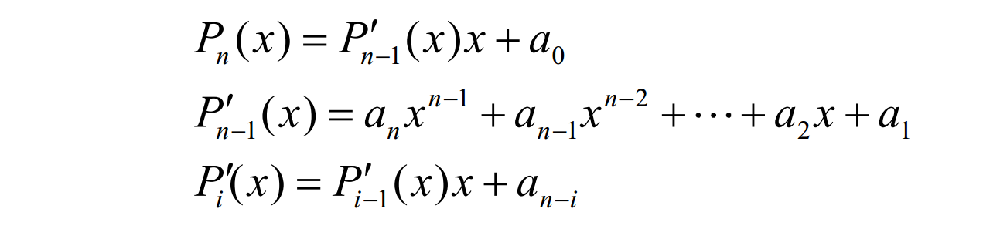
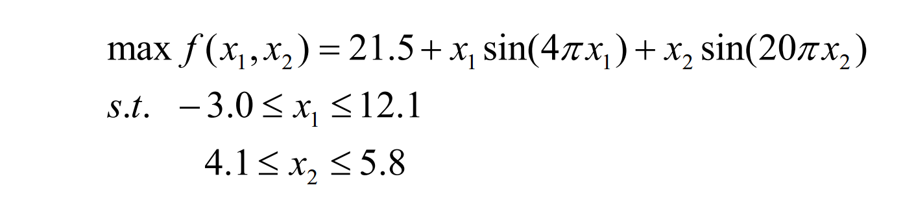
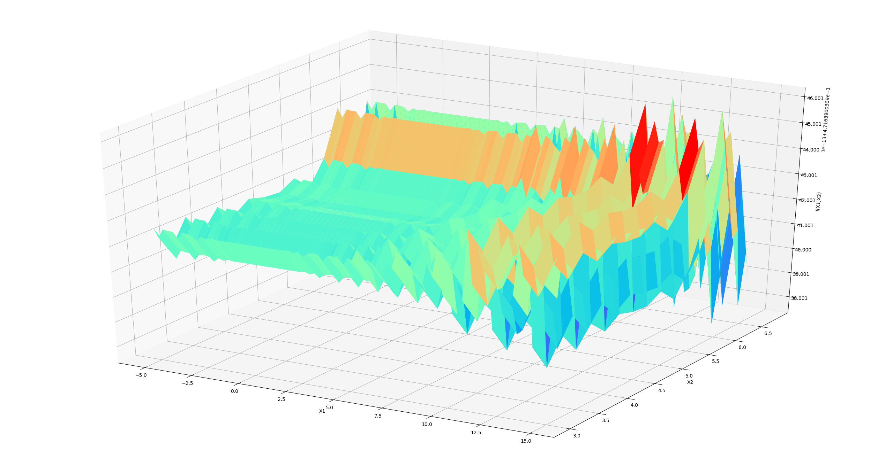
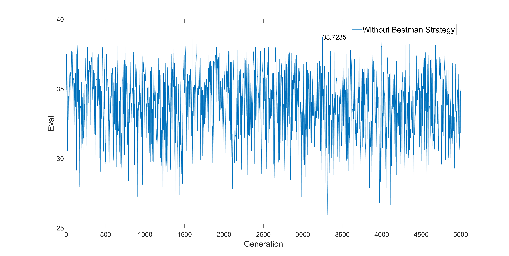
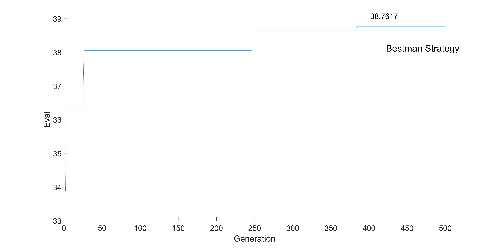
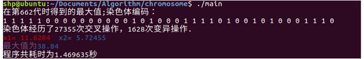

# Introduction
This repository is about three algoritms, such as strassen matrix,
polynomial evaluation and Evolutionary calculation method. And C++
is used to calculate result tested in Ubuntu 18.04, Python and
Matlab are used to plot the result.
# How to Run
**1. Strassen matrix**
```shell
$ cd ./Matrix
$ make clean
$ make
$ ./main
```
**2. Polynomial evaluation**
```shell
$ cd ./Polynomial
$ make clean
$ make
$ ./main
```
**3. Evolutionary calculation**
```shell
$ cd ./chromosome
$ make clean
$ make
$ ./main
```
# Details
## Strassen matrix description
Matrix multiple problem can be devide into several blocks:



`T(N)=O(N^2.81)`

**Result**

```
    Round    1    Mode 1 costs   2e-06   seconds!
    Round    1    Mode 2 costs   1.1e-05   seconds!
    Round    1    Mode 3 costs   6e-06   seconds!
    Round    2    Mode 1 costs   4e-06   seconds!
    Round    2    Mode 2 costs   2.3e-05   seconds!
    Round    2    Mode 3 costs   2e-05   seconds!
    Round    3    Mode 1 costs   2.6e-05   seconds!
    Round    3    Mode 2 costs   0.000104   seconds!
    Round    3    Mode 3 costs   9.7e-05   seconds!
    Round    4    Mode 1 costs   0.000233   seconds!
    Round    4    Mode 2 costs   0.000771   seconds!
    Round    4    Mode 3 costs   0.000604   seconds!
    Round    5    Mode 1 costs   0.001751   seconds!
    Round    5    Mode 2 costs   0.004166   seconds!
    Round    5    Mode 3 costs   0.003808   seconds!
    Round    6    Mode 1 costs   0.012725   seconds!
    Round    6    Mode 2 costs   0.031629   seconds!
    Round    6    Mode 3 costs   0.026681   seconds!
    Round    7    Mode 1 costs   0.108709   seconds!
    Round    7    Mode 2 costs   0.245282   seconds!
    Round    7    Mode 3 costs   0.186738   seconds!
    Round    8    Mode 2 costs   2.16051   seconds!
    Round    8    Mode 3 costs   1.39623   seconds!
    Round    9    Mode 1 costs   15.8762   seconds!
    Round    9    Mode 2 costs   17.5623   seconds!
    Round    9    Mode 3 costs   9.89237   seconds!
    Round    10    Mode 1 costs   149.123   seconds!
    Round    10    Mode 2 costs   144.846   seconds!
    Round    10    Mode 3 costs   72.203   seconds!
    Round    11    Mode 1 costs   1326.32   seconds!
    Round    11    Mode 2 costs   1216.94   seconds!
    Round    11    Mode 3 costs   530.189   seconds!
```
## Polynomial evaluation

### Recursive method
```c++
begin
    1. P := a0; Q := 1;
    2. for i = 1 to n do
    3. Q = Qx
    4. P = P + aiQ
    end
end
```
`T(N)=O(N)`
### Induction method

```c++
begin
    1. P := an
    2. for i = 1 to n do
    3. P = xP + an-i;
    end
end
```
`T(N)=O(N)`

**Result**


```
    Round    1    Mode    2    costs   2e-06   seconds!
    Round    1    Mode    3    costs   1e-06   seconds!
    Round    1    Mode    4    costs   1e-06   seconds!
    Round    2    Mode    1    costs   8e-06   seconds!
    Round    2    Mode    2    costs   6e-06   seconds!
    Round    2    Mode    3    costs   1e-06   seconds!
    Round    2    Mode    4    costs   1e-06   seconds!
    Round    3    Mode    1    costs   2e-05   seconds!
    Round    3    Mode    2    costs   2e-05   seconds!
    Round    3    Mode    3    costs   1e-06   seconds!
    Round    3    Mode    4    costs   1e-06   seconds!
    Round    4    Mode    1    costs   4.6e-05   seconds!
    Round    4    Mode    2    costs   4.5e-05   seconds!
    Round    4    Mode    3    costs   1e-06   seconds!
    Round    4    Mode    4    costs   2e-06   seconds!
    Round    5    Mode    1    costs   8.2e-05   seconds!
    Round    5    Mode    2    costs   8.2e-05   seconds!
    Round    5    Mode    3    costs   2e-06   seconds!
    Round    5    Mode    4    costs   2e-06   seconds!
    Round    6    Mode    1    costs   0.000188   seconds!
    Round    6    Mode    2    costs   0.000188   seconds!
    Round    6    Mode    3    costs   2e-06   seconds!
    Round    6    Mode    4    costs   3e-06   seconds!
    Round    7    Mode    1    costs   0.000338   seconds!
    Round    7    Mode    2    costs   0.000338   seconds!
    Round    7    Mode    3    costs   2e-06   seconds!
    Round    7    Mode    4    costs   3e-06   seconds!
    Round    8    Mode    1    costs   0.000554   seconds!
    Round    8    Mode    2    costs   0.000532   seconds!
    Round    8    Mode    3    costs   3e-06   seconds!
    Round    8    Mode    4    costs   4e-06   seconds!
    Round    9    Mode    1    costs   0.224067   seconds!
    Round    9    Mode    2    costs   0.224445   seconds!
    Round    9    Mode    3    costs   6.4e-05   seconds!
    Round    9    Mode    4    costs   9.6e-05   seconds!
    Round    10    Mode    1    costs   0.900165   seconds!
    Round    10    Mode    2    costs   0.903975   seconds!
    Round    10    Mode    3    costs   9.3e-05   seconds!
    Round    10    Mode    4    costs   0.00016   seconds!
    Round    11    Mode    1    costs   5.61629   seconds!
    Round    11    Mode    2    costs   5.5996   seconds!
    Round    11    Mode    3    costs   0.000229   seconds!
    Round    11    Mode    4    costs   0.000401   seconds!
    Round    12    Mode    1    costs   22.4098   seconds!
    Round    12    Mode    2    costs   22.4182   seconds!
    Round    12    Mode    3    costs   0.00047   seconds!
    Round    12    Mode    4    costs   0.000801   seconds!
```
## Evolutionary calculation




**Output**


# Contact me
`Email`:shp395210@outlook.com
